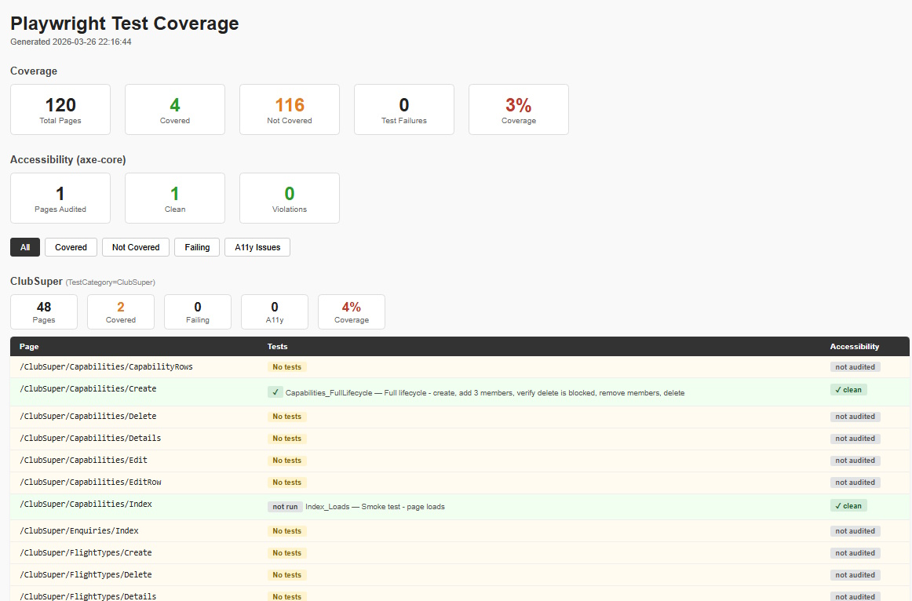

# Playwright E2E Testing with AI-Assisted Test Authoring

This repository shows how we built and maintain a practical end-to-end test suite for a real production web application — a multi-role EASA compliant flight club management system with around 110 pages across four user roles. It is not a framework you can drop into your project unchanged. It is a set of decisions and patterns you can read, and adapt.

The companion tool — `TestBuilderTool/` — is a local web UI that combines Playwright browser automation with the Claude AI API to help write tests through conversation. That is documented separately in `TestBuilderTool/DESIGN.md`.

### You can watch a demo of this here:

[](https://youtu.be/_PFQgEdFgCw)

---

## Why E2E testing matters more now, not less

AI-assisted development has fundamentally changed the speed at which code gets written. Features that used to take days take hours. That acceleration is real and valuable — but it compresses the feedback loop in ways that can bite you. When a developer and an AI pair write code quickly across many parts of a system, the risk is not that any single piece is wrong. The risk is that pieces that worked yesterday break silently when something else changes today.

End-to-end tests are the safety net for that kind of development. They do not test units in isolation — they test that the whole system, from the browser to the database, does what it is supposed to do for a real user. That is exactly the kind of regression that AI-accelerated development is most likely to introduce and least likely to catch on its own.

The problem has always been that E2E tests are expensive to write and most teams skip it or let the test suite rot. That calculus has changed. With AI assistance, the mechanical cost of writing a test drops dramatically. What used to take an hour takes minutes. That makes a comprehensive E2E suite achievable for teams that could never have justified it before.

The critical insight is what AI changes and what it does not. AI writes the test. The test itself is deterministic. Once written and committed, it runs the same way every time, against the real application, with no AI involved. The output is a reliable, repeatable artefact — not an AI opinion. You get the speed of AI authoring with the trustworthiness of conventional automated testing. Those two things are not in tension. They are additive.

---

## Architecture in an AI-assisted world

The shift to AI-assisted development does not just change how fast you write code — it changes the risk profile of the code you write. When an AI generates a solution, it draws on patterns from across a vast body of code. That is its strength. It is also where things go wrong: the generated code tends toward cleverness, abstraction, and generality even when the problem in front of you is specific and simple. Left unchecked, an AI-assisted codebase accumulates indirection, non-obvious dependencies, and execution paths that are hard to follow — not because anyone made a bad decision, but because each individual suggestion looked reasonable in isolation.

The architectural response is deliberate simplicity. Code that will be touched by AI — read by it, extended by it, debugged with its help — needs to be more explicit, not less. That means preferring flat execution paths over deeply nested chains of calls. It means passing values directly rather than resolving them through conventions or registrations that the AI cannot see in context. It means keeping methods short and linear so that when something fails, the failure is at a visible line.

Verbosity is not a weakness here. A few extra lines of obvious code are worth more than a compact expression that requires the reader — human or AI — to reason about what it resolves to at runtime. The goal is code where the execution path can be read top to bottom without holding invisible state in your head. This matters especially in a test codebase, where the tests themselves need to be trustworthy. A test suite that is hard to understand is a test suite you stop trusting.

---

### Governing AI behaviour with explicit instructions

Speed without guardrails creates drift. Every AI session starts fresh, and without explicit constraints it will make locally reasonable suggestions that conflict with decisions the team made three weeks ago. The same abstraction gets introduced twice. A pattern that was deliberately avoided reappears. Complexity accumulates not through any single bad decision but through the absence of a shared memory.

A `CLAUDE.md` file — instructions that travel with the codebase and are loaded into context automatically — is the practical answer to this. Think of it as the architectural constitution for the project: what patterns are permitted, what is explicitly forbidden, how things should be named, what the AI must never do without being asked. The instructions need to be specific and opinionated to be effective. "Write clean code" is not a constraint. "Do not introduce interfaces unless there are two concrete implementations that require them" is.

This also serves a second purpose. When the instructions are written down and version-controlled, they force the team to make architectural decisions explicitly rather than leaving them implicit. Implicit decisions are the ones that AI — and new team members — will override without realising it.

The broader point is this: AI-accelerated development requires more discipline about architecture, not less. The speed gain is real, but so is the risk of accumulating complexity that no single person fully understands. Simple, linear, explicit code combined with clear written constraints is the hedge against that risk. It is also the environment where AI tools produce their best work — because when the context is unambiguous and the rules are visible, the suggestions improve accordingly.

---

## The approach: AI in the loop, not in charge

We use a three-layer model that combines automatic discovery of all pages in the solution to be tested and an easy webpage(TestBuilderTool) to navigate and you visualy see what pages have tests and what is not covered and a dialogue with claude through Playwright MCP creates the test.

**Layer 1 — AI discovers.** The TestBuilderTool navigates the live app as the correct user role, takes a screenshot, and extracts the interactive elements on the page. This gives Claude real, current selectors to work with rather than selectors guessed from a description. Claude then generates a complete, compilable C# test class using the project's conventions.

**Layer 2 — The developer provides business rules.** This is the part AI cannot do. "A flight registration should deduct the correct amount from the member's account balance based on the active tariff" is knowledge that lives in the developer's head, not on the page. The developer describes what correct behaviour looks like through the chat interface, and Claude incorporates it into the test.

**Layer 3 — AI reviews.** Once a test is written, you can ask: "What could pass while the feature is still broken?" This catches weak assertions — tests that navigate to a page and check the title without verifying that the data is actually correct. It is a fast second opinion before committing.

The deliberate decision here was to keep the developer as the judgment layer. AI handles the mechanical parts — selector discovery, boilerplate, convention compliance — and the developer handles what "correct" actually means.


### Coverage report 
 

---

## Infrastructure decisions

### Two-phase browser setup

Login is mechanical. Running four login flows in slow motion every time you debug a test is waste. The fix is to separate concerns: run logins always fast and headless, then launch the real browser with whatever debug settings apply to the tests themselves.

`GlobalSetup.cs` does this in two explicit phases. A temporary headless browser launches, logs in as each user role, saves the auth state — cookies and session — to a JSON file on disk, then closes. The real browser launches next, configured by environment variables: headed mode, slow-motion, or connected to an external Chrome via CDP for keeping failed tabs open. Tests load their auth state from the files written in phase one. The two phases have no shared state and no dependency on each other beyond the files on disk.

### TestUsers

`Setup/TestUsers.cs` is a static class that loads all test users directly from `testsettings.json` at startup. Each user bundles their username, password, role, name, ID number, and auth state file path together in one object. `TestUsers.All` gives you the full list.

The reason for bundling them this way is that you frequently need to iterate over all users — for seeding the database, for logging in, for creating shared browser contexts. When each user carries all the information about themselves, you cannot accidentally mismatch a credential with the wrong auth state file or forget to add a new user to one of the four separate lists.

### Role-based base classes

A test declares its required role by choosing which base class to inherit from. There is no per-test configuration, no attribute to set, no way to forget. Each area of the application has its own base class — `AdminTestBase`, `SuperTestBase`, `TrainingTestBase`, `UserPagesTestBase` — each inheriting from `AuthenticatedPageTest` and overriding only one property: which auth state file to use. That is the entire mechanism.

### AuthenticatedPageTest

Rather than repeat the same setup and teardown in every test class, `AuthenticatedPageTest` handles everything that is identical across all tests: creating the browser context with the correct auth state, starting a Playwright trace, and on completion either saving the trace and video path on failure or discarding them silently on pass. It also records the result against the page URL declared in the `[PageTest]` attribute, which feeds the coverage report.

Two context modes are supported via environment variable. The default gives each test its own isolated context, which is safe for parallel runs. `SHARED_CONTEXT=1` makes all tests for a role share one persistent context — useful for finding session leaks between tests.

### The coverage report

The gap between "we have tests" and "we know which pages have no tests" is where coverage dies silently. A list maintained by hand goes stale the moment someone adds a page and forgets to update it.

`Reporting/PageDiscovery.cs` solves this by scanning the actual source tree for `.cshtml` files with an `@page` directive. The list of pages comes from what is actually deployed, not from what someone remembered to register. When a new page is added to the application, it appears in the report as uncovered automatically.

Tests declare which page they cover with the `[PageTest]` attribute:

```csharp
[TestMethod]
[PageTest("/Admin/Members", "Members list loads and passes accessibility audit")]
public async Task Index_LoadsAndPassesA11y()
{
    await Page.GotoAsync($"{TestSettings.CmsWebUrl}/Admin/Members");
    await Expect(Page).ToHaveTitleAsync(new Regex(".+"));
    await CheckAccessibility();
}
```

`CoverageReportGenerator.cs` matches those declarations against the discovered pages and produces a single HTML file after every run. It shows pass/fail per test, links to trace and video artifacts on failures, and includes an accessibility column from axe-core results. It is generated locally, requires no external service, and opens in any browser.

### Accessibility auditing

`AuthenticatedPageTest.CheckAccessibility()` runs an axe-core audit against the current page and feeds the result into the coverage report automatically. One call per test is enough — the infrastructure handles collection and reporting.

### API interception

`Utilities/ApiInterceptor.cs` captures outbound HTTP requests without blocking them. Use it when you need to verify that a user action triggers the correct API call — the kind of assertion that a page-level check cannot make.

```csharp
await using var interceptor = await ApiInterceptor.StartAsync(Page, "**/api/flights/**");
await Page.ClickAsync("button#save");
Assert.IsTrue(interceptor.AnyPost(), "Expected a POST to the flights API");
```

### Test data seeding

Seeding through the UI is slow and fragile — it also means your seeding breaks whenever the login or create flow breaks, which is exactly when you need your tests to work. The alternative is to go directly to the data layer.

 `Database/AmplusApi.cs` creates corresponding member records through the REST API. Both are called from `GlobalSetup` before any tests run and both are idempotent — they check for existence before creating. The pattern is what matters here, not the specific implementations, which are tied to this application.

---

## What you would adapt

**`Database/`** — Replace with whatever seeding your application needs. The contract is simple: idempotent, called once before tests run, no browser involved.

**Login selectors in `GlobalSetup.LoginAndSaveState`** — The form field names and post-login URL are specific to this application. Change them to match your login form.

**`Reporting/PageDiscovery.cs`** — The source paths and skip lists are hardcoded. Point them at your application's pages folder.

**`TestBuilderTool/.env`** — Copy `.env.example` and fill in your Claude API key, app URL, and test user credentials.

**`testsettings.json`** — Copy `testsettings.example.json` and fill in your values. This file is git-ignored and never committed.

---

## Closing thoughts

What this approach gives you is a test suite that grows at the speed of AI and runs at the reliability of conventional automation. The two have always been in tension — fast to write meant fragile, reliable meant slow to build. AI-assisted authoring with deterministic execution resolves that tension in a way that was not practical before.

The cost is discipline. You have to write the architectural rules down, enforce them through code review and explicit AI instructions, and resist the pull toward patterns that look smart but add complexity. That discipline pays back quickly — in tests you can trust, in a codebase that stays navigable, and in an AI that gets more useful the clearer the constraints are.

---

## Running

```bash
# TestBuilderTool
cd TestBuilderTool && cp .env.example .env   # fill in your values
npm start                                     # open http://localhost:3333

# PlaywrightTests
cp testsettings.example.json testsettings.json   # fill in your values
dotnet test PlaywrightTests/PlaywrightTests.csproj
```
